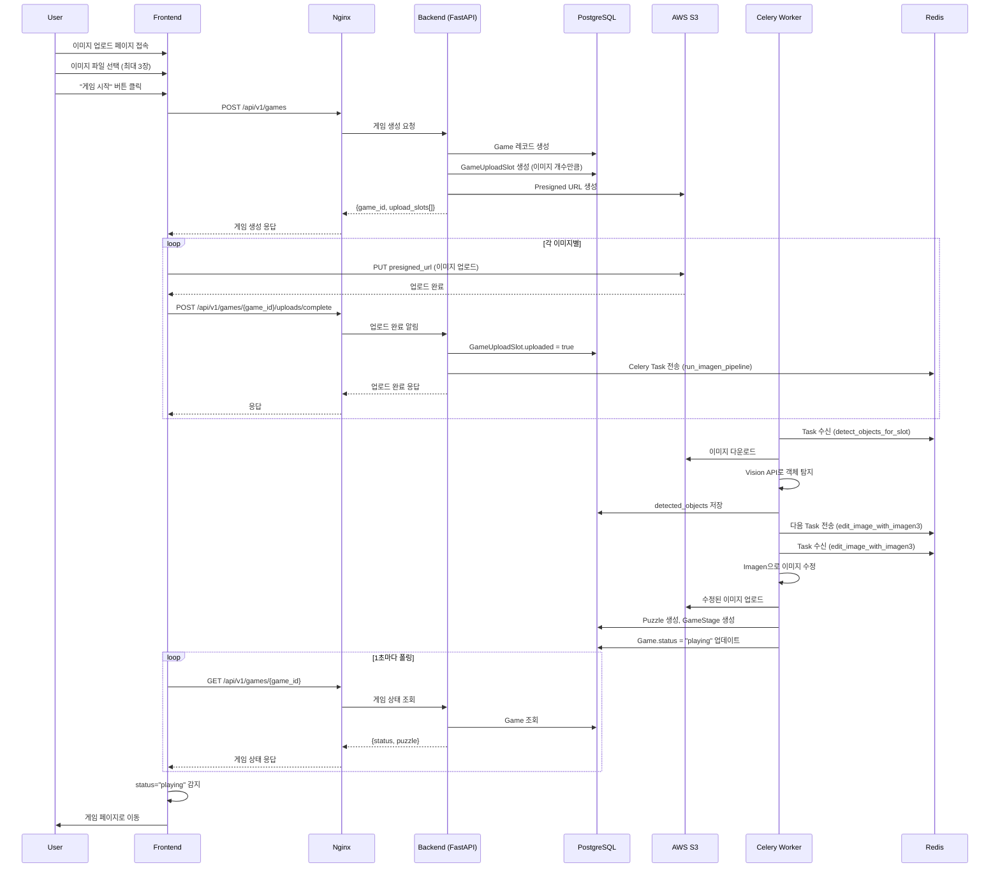
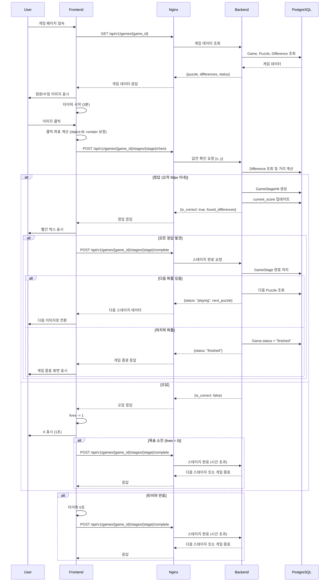
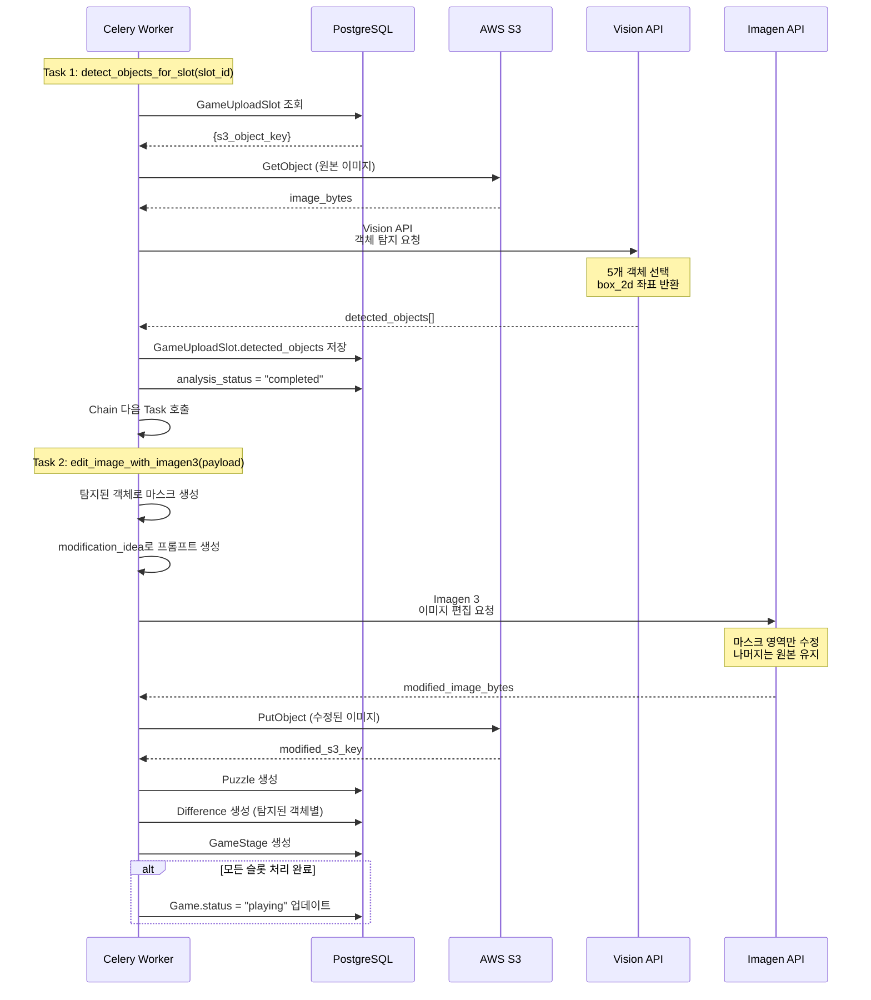
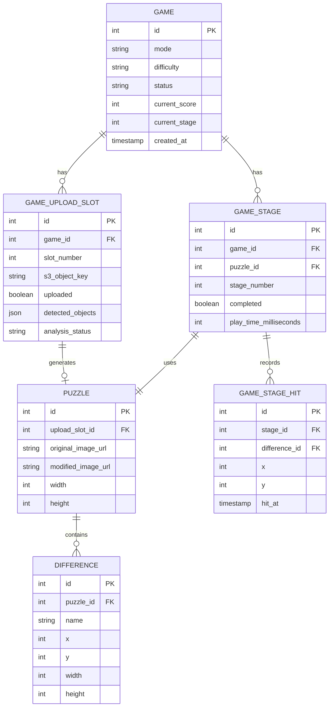
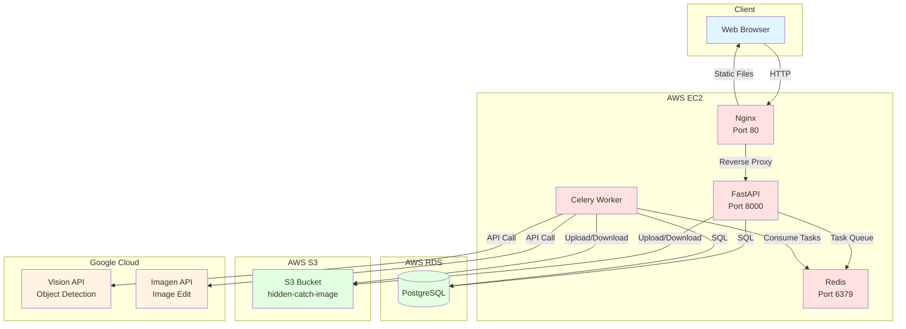

# Hidden Catch - Sequence Diagrams

## 1. 게임 생성 및 이미지 업로드 플로우

```mermaid
sequenceDiagram
    participant U as User
    participant F as Frontend
    participant N as Nginx
    participant B as Backend (FastAPI)
    participant DB as PostgreSQL
    participant S3 as AWS S3
    participant C as Celery Worker
    participant R as Redis

    U->>F: 이미지 업로드 페이지 접속
    U->>F: 이미지 파일 선택 (최대 3장)
    U->>F: "게임 시작" 버튼 클릭
    
    F->>N: POST /api/v1/games
    N->>B: 게임 생성 요청
    B->>DB: Game 레코드 생성
    B->>DB: GameUploadSlot 생성 (이미지 개수만큼)
    B->>S3: Presigned URL 생성
    B-->>N: {game_id, upload_slots[]}
    N-->>F: 게임 생성 응답
    
    loop 각 이미지별
        F->>S3: PUT presigned_url (이미지 업로드)
        S3-->>F: 업로드 완료
        F->>N: POST /api/v1/games/{game_id}/uploads/complete
        N->>B: 업로드 완료 알림
        B->>DB: GameUploadSlot.uploaded = true
        B->>R: Celery Task 전송 (run_imagen_pipeline)
        B-->>N: 업로드 완료 응답
        N-->>F: 응답
    end
    
    C->>R: Task 수신 (detect_objects_for_slot)
    C->>S3: 이미지 다운로드
    C->>C: Vision API로 객체 탐지
    C->>DB: detected_objects 저장
    C->>R: 다음 Task 전송 (edit_image_with_imagen3)
    
    C->>R: Task 수신 (edit_image_with_imagen3)
    C->>C: Imagen으로 이미지 수정
    C->>S3: 수정된 이미지 업로드
    C->>DB: Puzzle 생성, GameStage 생성
    C->>DB: Game.status = "playing" 업데이트
    
    loop 1초마다 폴링
        F->>N: GET /api/v1/games/{game_id}
        N->>B: 게임 상태 조회
        B->>DB: Game 조회
        B-->>N: {status, puzzle}
        N-->>F: 게임 상태 응답
    end
    
    F->>F: status="playing" 감지
    F->>U: 게임 페이지로 이동
```

## 2. 게임 플레이 플로우

```mermaid
sequenceDiagram
    participant U as User
    participant F as Frontend
    participant N as Nginx
    participant B as Backend
    participant DB as PostgreSQL

    U->>F: 게임 페이지 접속
    F->>N: GET /api/v1/games/{game_id}
    N->>B: 게임 데이터 조회
    B->>DB: Game, Puzzle, Difference 조회
    DB-->>B: 게임 데이터
    B-->>N: {puzzle, differences, status}
    N-->>F: 게임 데이터 응답
    
    F->>U: 원본/수정 이미지 표시
    F->>F: 타이머 시작 (3분)
    
    U->>F: 이미지 클릭
    F->>F: 클릭 좌표 계산 (object-fit: contain 보정)
    
    F->>N: POST /api/v1/games/{game_id}/stages/{stage}/check
    N->>B: 답안 확인 요청 {x, y}
    B->>DB: Difference 조회 및 거리 계산
    
    alt 정답 (오차 50px 이내)
        B->>DB: GameStageHit 생성
        B->>DB: current_score 업데이트
        B-->>N: {is_correct: true, found_differences}
        N-->>F: 정답 응답
        F->>U: 빨간 박스 표시
        
        alt 모든 정답 발견
            F->>N: POST /api/v1/games/{game_id}/stages/{stage}/complete
            N->>B: 스테이지 완료 요청
            B->>DB: GameStage 완료 처리
            
            alt 다음 퍼즐 있음
                B->>DB: 다음 Puzzle 조회
                B-->>N: {status: "playing", next_puzzle}
                N-->>F: 다음 스테이지 데이터
                F->>U: 다음 이미지로 전환
            else 마지막 퍼즐
                B->>DB: Game.status = "finished"
                B-->>N: {status: "finished"}
                N-->>F: 게임 종료 응답
                F->>U: 게임 종료 화면 표시
            end
        end
    else 오답
        B-->>N: {is_correct: false}
        N-->>F: 오답 응답
        F->>F: lives -= 1
        F->>U: X 표시 (1초)
        
        alt 목숨 소진 (lives = 0)
            F->>N: POST /api/v1/games/{game_id}/stages/{stage}/complete
            N->>B: 스테이지 완료 (시간 초과)
            B-->>N: 다음 스테이지 또는 게임 종료
            N-->>F: 응답
        end
    end
    
    alt 타이머 만료
        F->>F: 타이머 0초
        F->>N: POST /api/v1/games/{game_id}/stages/{stage}/complete
        N->>B: 스테이지 완료 (시간 초과)
        B-->>N: 다음 스테이지 또는 게임 종료
        N-->>F: 응답
    end
```

## 3. AI 이미지 처리 파이프라인

```mermaid
sequenceDiagram
    participant C as Celery Worker
    participant DB as PostgreSQL
    participant S3 as AWS S3
    participant V as Vision API
    participant I as Imagen API

    Note over C: Task 1: detect_objects_for_slot(slot_id)
    
    C->>DB: GameUploadSlot 조회
    DB-->>C: {s3_object_key}
    
    C->>S3: GetObject (원본 이미지)
    S3-->>C: image_bytes
    
    C->>V: Vision API<br/>객체 탐지 요청
    Note over V: 5개 객체 선택<br/>box_2d 좌표 반환
    V-->>C: detected_objects[]
    
    C->>DB: GameUploadSlot.detected_objects 저장
    C->>DB: analysis_status = "completed"
    
    C->>C: Chain 다음 Task 호출
    
    Note over C: Task 2: edit_image_with_imagen3(payload)
    
    C->>C: 탐지된 객체로 마스크 생성
    C->>C: modification_idea로 프롬프트 생성
    
    C->>I: Imagen 3<br/>이미지 편집 요청
    Note over I: 마스크 영역만 수정<br/>나머지는 원본 유지
    I-->>C: modified_image_bytes
    
    C->>S3: PutObject (수정된 이미지)
    S3-->>C: modified_s3_key
    
    C->>DB: Puzzle 생성
    C->>DB: Difference 생성 (탐지된 객체별)
    C->>DB: GameStage 생성
    
    alt 모든 슬롯 처리 완료
        C->>DB: Game.status = "playing" 업데이트
    end
```

## 4. 데이터베이스 ER Diagram

```mermaid
erDiagram
    GAME ||--o{ GAME_UPLOAD_SLOT : has
    GAME ||--o{ GAME_STAGE : has
    GAME_UPLOAD_SLOT ||--o| PUZZLE : generates
    PUZZLE ||--o{ DIFFERENCE : contains
    GAME_STAGE ||--|| PUZZLE : uses
    GAME_STAGE ||--o{ GAME_STAGE_HIT : records

    GAME {
        int id PK
        string mode
        string difficulty
        string status
        int current_score
        int current_stage
        timestamp created_at
    }

    GAME_UPLOAD_SLOT {
        int id PK
        int game_id FK
        int slot_number
        string s3_object_key
        boolean uploaded
        json detected_objects
        string analysis_status
    }

    PUZZLE {
        int id PK
        int upload_slot_id FK
        string original_image_url
        string modified_image_url
        int width
        int height
    }

    DIFFERENCE {
        int id PK
        int puzzle_id FK
        string name
        int x
        int y
        int width
        int height
    }

    GAME_STAGE {
        int id PK
        int game_id FK
        int puzzle_id FK
        int stage_number
        boolean completed
        int play_time_milliseconds
    }

    GAME_STAGE_HIT {
        int id PK
        int stage_id FK
        int difference_id FK
        int x
        int y
        timestamp hit_at
    }
```

## 5. 시스템 아키텍처

```mermaid
graph TB
    subgraph "Client"
        Browser[Web Browser]
    end

    subgraph "AWS EC2"
        Nginx[Nginx<br/>Port 80]
        Backend[FastAPI<br/>Port 8000]
        Celery[Celery Worker]
        Redis[Redis<br/>Port 6379]
    end

    subgraph "AWS RDS"
        PostgreSQL[(PostgreSQL)]
    end

    subgraph "AWS S3"
        S3[S3 Bucket<br/>hidden-catch-image]
    end

    subgraph "Google Cloud"
        Vision[Vision API<br/>Object Detection]
        Imagen[Imagen API<br/>Image Edit]
    end

    Browser -->|HTTP| Nginx
    Nginx -->|Reverse Proxy| Backend
    Nginx -->|Static Files| Browser
    
    Backend -->|SQL| PostgreSQL
    Backend -->|Task Queue| Redis
    Backend -->|Upload/Download| S3
    
    Celery -->|Consume Tasks| Redis
    Celery -->|SQL| PostgreSQL
    Celery -->|Upload/Download| S3
    Celery -->|API Call| Vision
    Celery -->|API Call| Imagen

    style Browser fill:#e1f5ff
    style Nginx fill:#ffe1e1
    style Backend fill:#ffe1e1
    style Celery fill:#ffe1e1
    style Redis fill:#ffe1e1
    style PostgreSQL fill:#e1ffe1
    style S3 fill:#e1ffe1
    style Vision fill:#fff3e1
    style Imagen fill:#fff3e1
```
